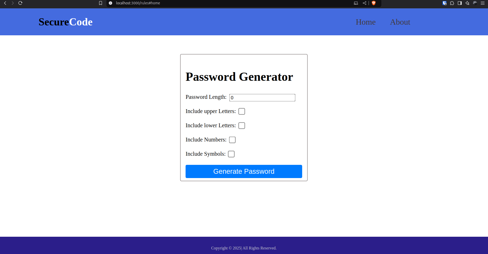
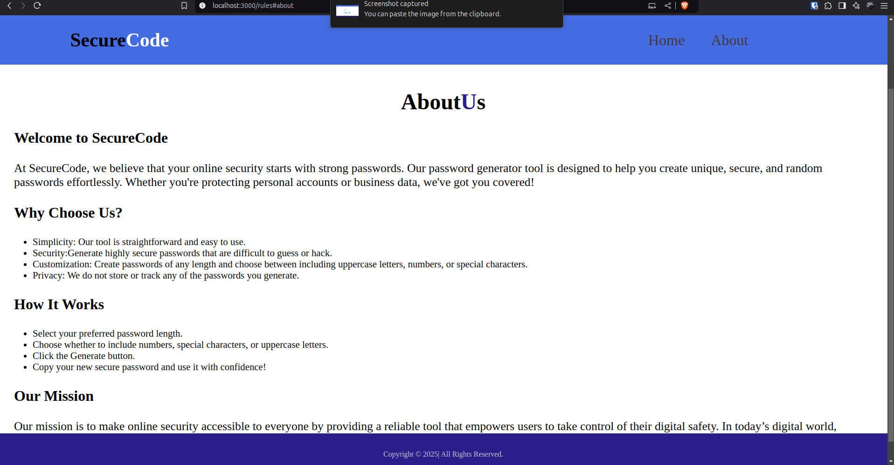
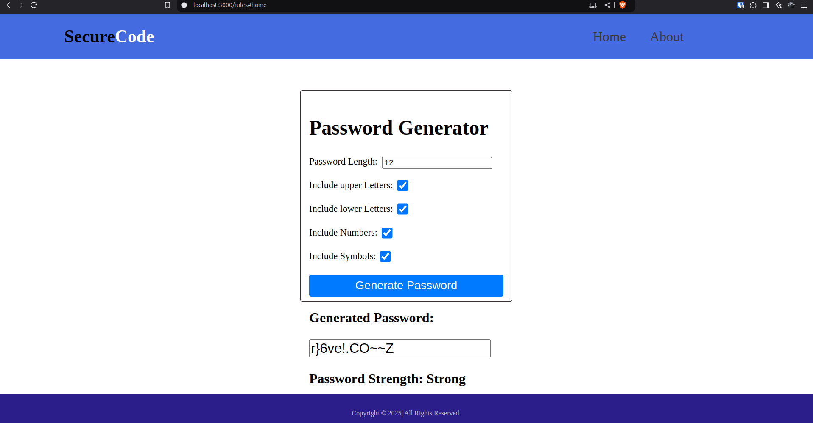

##SecureCode

#Basic Details
-Front-end:React,html,css,javascript

#Team Name:Lumino

#Team Members
-Aleena P Mathews-Saintgits Collage of Engineering
-Alna Soni-Saintgits Collage of Engineering

#Hosted Project Link:https://drive.google.com/drive/folders/1oXnZdTBuqV67Rx7aXMzsFqVeuHHttoCj?usp=sharing

#Project Description
The Password Generator website creates secure, random, and customizable passwords for users, ensuring strong online account security and convenience in managing credentials.

#The Problem Statement
People are terrible at creating strong passwords. They either use overly simple passwords or repeat the same one everywhere, making their accounts vulnerable to hacking.

#The Solution
We’re bringing fun and function together by automating the password creation process with a secure generator. It’s easy to use, customizable, and makes sure your password isn’t “password123” ever again!

##Technical Details

#Technologies/Components Used
For Software:

Languages used: HTML, CSS, JavaScript
Frameworks used: React
Tools used: VS Code, Git, GitHub

##implementation
This project is a Password Generator and Strength Identifier website that helps users create strong, secure, and unique passwords while identifying weak ones. It ensures password safety by providing real-time feedback on password strength and suggesting improvements for weak passwords. The platform also generates customizable, complex passwords based on user-defined criteria, enhancing online security.

##Installation

##Run
npm start

##Project Documentation
#Screenshots

